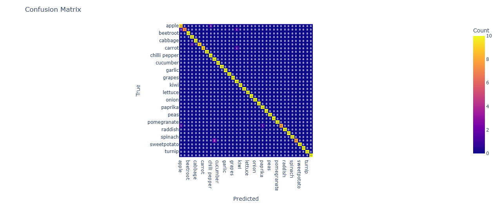

# 🍏 Fruits and Veggies Detection System

## 📜 Overview

The **Fruits and Veggies Detection System** is a Convolutional Neural Network (CNN) based model designed to detect and classify various types of fruits from images. Trained on a comprehensive dataset of fruit images, this application is capable of providing **real-time predictions** using a Image or Camera. It is designed for diverse scenarios, including identifying fruits in markets, automating sorting systems, and serving as a tool for nutritional analysis.

## 📊 Model Prediction Performance

Our 36-class Fruits and Vegetables Detection Model has been evaluated using a Confusion Matrix Heatmap! 🌟 Here's how the model performed:



### 🔍 Key Highlights:
- ✅ **Accurate Predictions**: Most classes are correctly identified, as seen along the diagonal.  
- ⚠️ **Misclassifications**: Some overlap exists for similar items (e.g., [mention example if needed]).  
- 📈 **Performance Insights**: The heatmap provides a clear overview of the model's strengths and areas for improvement.  

This visual representation helps us understand the model's behavior and refine it further! 🚀  

## 🌟 Features

- 🔍 **Real-Time Detection**: Utilizes a webcam to detect and classify fruits dynamically.
- 🎯 **Good Accuracy**: Achieves impressive accuracy with minimal overfitting through techniques such as data augmentation, regularization, and adaptive learning rate adjustments.

## ⚙️ Requirements

- Python 3.x
- TensorFlow 2.x
- OpenCV
- Numpy

To install the required packages, use the package manager [pip](https://pip.pypa.io/en/stable/):

```bash
pip install tensorflow opencv-python numpy
```

## 🏋️‍♂️ Model Training
The model was trained on a dataset of fruit images using a Convolutional Neural Network (CNN). Training was performed over multiple epochs with various strategies to enhance accuracy and generalization:

- **Data Augmentation:** Applied rotations, shifts, and flips to the training images to increase model robustness.
- **Regularization:** Utilized L2 regularization and dropout techniques to prevent overfitting.
- **Learning Rate Scheduler:** Dynamically adjusted the learning rate during training for smooth convergence.

## 📈 Training Results
- Below are the results of the last 10 epochs:
```
Epoch 10/30: loss: 0.5628 - accuracy: 0.8148 - val_loss: 0.3881 - val_accuracy: 0.8974
Epoch 11/30: loss: 0.4762 - accuracy: 0.8440 - val_loss: 0.3556 - val_accuracy: 0.8974
Epoch 12/30: loss: 0.4402 - accuracy: 0.8629 - val_loss: 0.3416 - val_accuracy: 0.9145
...
Epoch 19/30: loss: 0.1981 - accuracy: 0.9400 - val_loss: 0.2554 - val_accuracy: 0.9516
```
